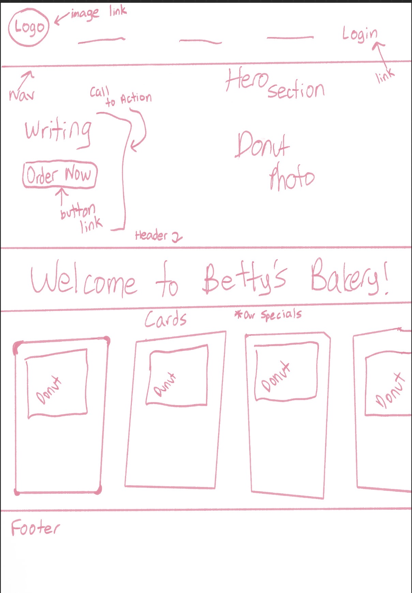
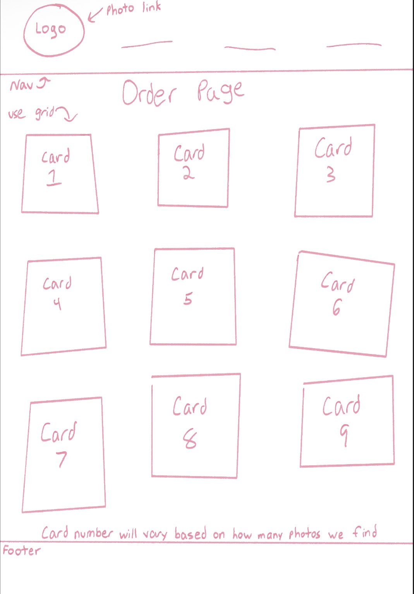
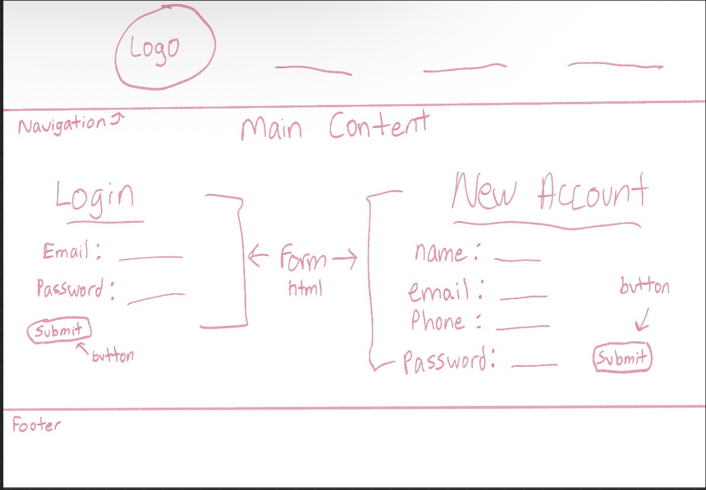

Design Markups:

1st meeting
Jan 10th 2026 
In person
Discussed what website should be about
She decided on doing pink theme
She decided on how logo should look using Canva
We created outline drawings of final website together 

2nd meeting
Jan 16th 2026
In person
I showed the logo and navigation bar and she liked it
She changed her mind about the hero image we were going to use
We ended up going with a different image for the hero

3rd meeting
Jan 19th 2026
In person
Instead of doing another form for the order page, we did a card style
She told me what kind of pictures she wanted
It took a long time for me to figure how to do the grid for the cards
She decided on doing the navigation font in Salmon instead of pink for the homepage

4th meeting
Jan 23rd 2026
In person
I showed her the login page and she said she liked it
We worked on the homepage cards and header
She said she wanted only donuts on the homepage cards
We decided to make those our "specials"

5th meeting
Jan 27th 2026
In person
Our last meeting
worked on the footer
looked at other bakery websites to see how they did theirs
