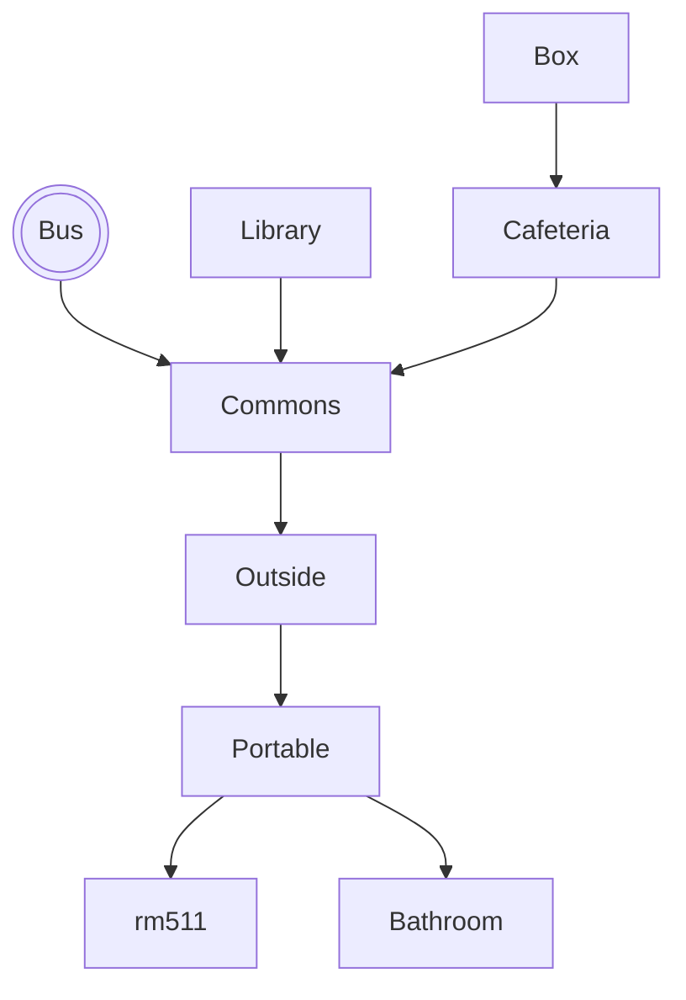

# Don't Miss The Bus!

## Setting

This game takes place at the main character's apartment in their bed room. 

## Map

The player starts on the bus, and then is directed into the Commons. T
They can explore, but must eventually make their way to rm511.

## Story

The player wakes up on a school day. They need to catch the bus in order to get to school. If they don't catch the school bus, there is no way for them to get to school. Before they get on the bus though, the have to complete certain morning routine tasks like picking out what to wear, eating breakfast, and brushing teeth.If they end up with extra time, there are other things they can add to their morning routine but if it takes too long, they risk missing the school bus. 

When the user gets to rm511, they learn that the teacher is asleep.
They must take the teacher's coffee mug to the library, get it 
filled, and then bring it back to the teacher.

The game starts 15 minutes before the morning class bell, and each
move costs 1 minute. So this journey must be completed in 15 moves.
Some moves (like reading a book in the library) cost extra time.

## Global Variables

The most important variables are
`haveCup` and `cupIsFull`, both
booleans that track progress in the
story. Depending on these two variables,
some rooms will display different things. For example, if you walk into the
library without the cup, it will prompt you to
read. If you walk in with the cup, it will show
the librarian filling the cup with coffee.

I also have numeric variables called `day` and `minute` which keep track of 
time. `minute` starts at 0 and counts up
with each move.

I have a little HUD map, and use a bunch of 
boolean variables to control which
rooms the player has discovered. A map is only displayed after the user
visits it.
